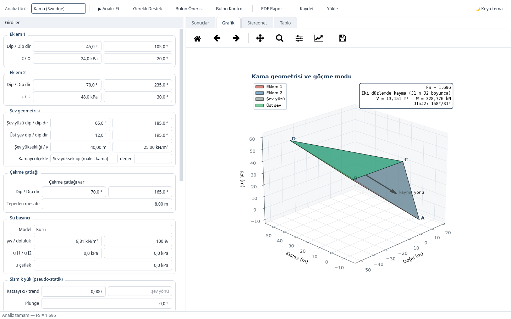
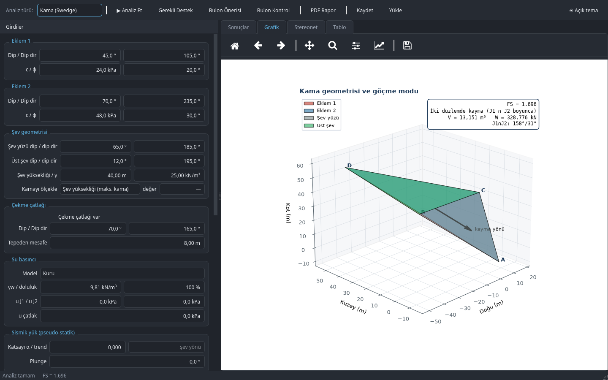

**English** | [Türkçe](README.tr.md)

# Kinematix v1.0 — Rock Slope Stability Analysis (PySide6)

Limit-equilibrium analysis of **wedge (Swedge)**, **planar (RocPlane)** and **toppling (RocTopple)**
failure using Hoek & Bray methods; rock bolt spacing/length design; professional PDF reporting.

## Screenshots
| Light theme | Dark theme |
|---|---|
|  |  |

## Install & run
```
pip install -r requirements.txt
python kinematix.py          # light/dark theme, F5-F8 shortcuts
```

## Layout
```
rockslope/            computation core (independent of the UI)
  core.py             vector/geometry helpers
  style.py            shared plotting style
  wedge.py            tetrahedral wedge: geometry, analysis, support, H&B validation, 3D, stereonet
  planar.py           planar sliding: analysis, support, 2D section
  toppling.py         block toppling: water + seismic + toe anchor, section
  bolts.py            bolt spacing/length design, capacity check for a chosen design
  report.py           PDF report (reportlab)
kinematix.py          PySide6 UI: dockable input panel, tabbed results/plot/table, background
                      support-design matrix, light/dark theme (remembered via QSettings),
                      last inputs, JSON save/load, PDF
tests/                pytest validation suite (comparison against closed-form solutions)
```

## Shortcuts
F5 Analyze · F6 Required support · F7 Bolt design · F8 Bolt check · Ctrl+P PDF · Ctrl+S / Ctrl+O save / load

## Single-file executable (optional)
```
pip install pyinstaller
pyinstaller --noconfirm --windowed --name Kinematix --collect-all reportlab kinematix.py
```
On Windows the report uses Arial (`C:\Windows\Fonts`) for Turkish characters; on Linux, DejaVu Sans.

## Validation
wedge — matches the Hoek & Bray closed-form short solution exactly (dry 1.696 / flooded 1.065);
planar — c=0, dry: tanφ/tanψp; toppling — Wyllie & Mah Chapter 9 example (block heights, failure modes,
limit-equilibrium φ≈38°).

These values are pinned with pytest under `tests/`; run it to catch regressions whenever the
core modules (`rockslope/`) change:
```
pip install -r requirements-dev.txt
pytest
```

## License
MIT — see [LICENSE](LICENSE). PySide6 is LGPL; no additional license is required for in-house
distribution.

## Troubleshooting (Windows)
**`ImportError: DLL load failed while importing QtCore`** → two different Qt installs loaded at once, or mismatched PySide6/shiboken6 versions.
1. Diagnose: `python check_env.py` (PySide6 and shiboken6 versions must match; PyQt5/PyQt6 present is a common conflict source).
2. Clean reinstall: `pip uninstall -y PySide6 PySide6-Essentials PySide6-Addons shiboken6` → `pip install PySide6`
3. Most robust: a separate virtual environment:
   ```
   python -m venv venv
   venv\Scripts\activate
   pip install -r requirements.txt
   python kinematix.py
   ```
4. If using Anaconda: `conda create -n kinematix python=3.11` → `conda activate kinematix` → `pip install -r requirements.txt`.
   (Avoid mixing the PyQt5/qt packages in the Anaconda base environment with pip-installed PySide6.)
5. If it still fails, install the Microsoft Visual C++ 2015–2022 Redistributable (x64).
