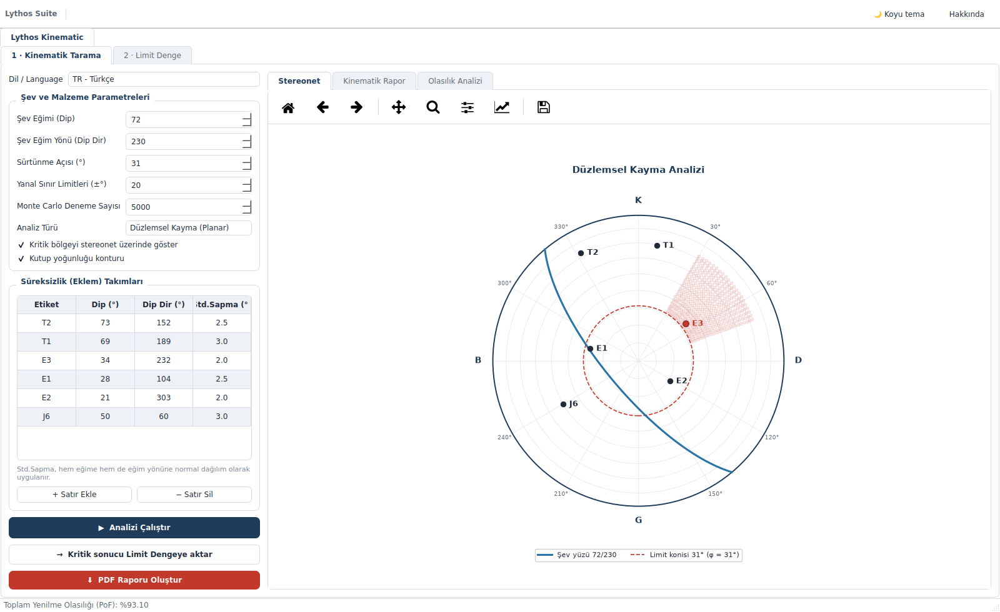
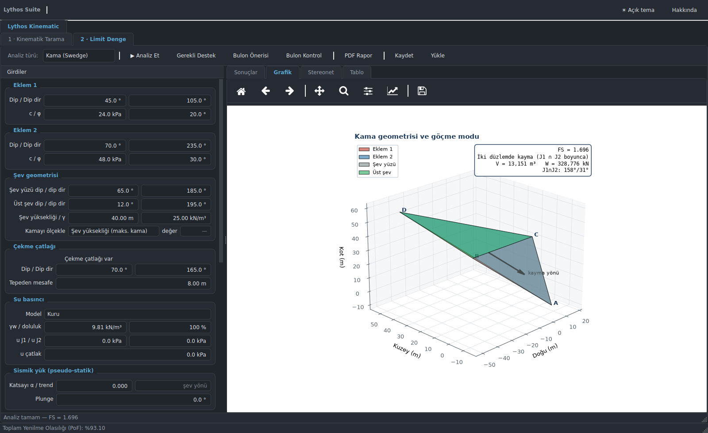
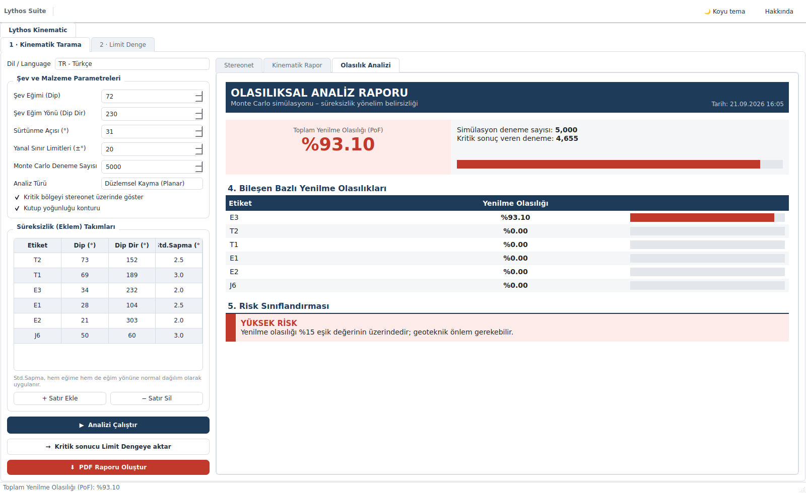

[English](README.md) | **Türkçe**

# Lythos Suite v1.0

Geoteknik analiz uygulama takımı. İlk modülü **Lythos Kinematic**, kaya şevi
kinematiği ve stabilitesini tek bir iş akışında birleştirir:

1. **Kinematik Tarama** — Markland testi, stereonet ve Monte Carlo olasılık analizi
   ile *hangi yenilme mekanizmasının mümkün olduğunu* belirler.
2. **Limit Denge** — kinematik olarak kritik bulunan mekanizma için *güvenlik
   sayısını, gerekli desteği ve bulon tasarımını* hesaplar.

İki adım arasında canlı bir köprü vardır: taramada bulunan en kritik süreksizlik
veya kesişim, tek tuşla limit denge girdilerine aktarılır.

> Bu uygulama, daha önce ayrı iki program olan **SlopeKinematics** (kinematik +
> olasılık) ve **Kinematix** (limit denge + bulon + rapor) projelerinin
> birleştirilmiş hâlidir. Ayrıntılar için [Birleştirme notları](#birleştirme-notları).

## Ekran görüntüleri

| Kinematik tarama (açık tema) | Limit denge (koyu tema) |
|---|---|
|  |  |

| Olasılık analizi raporu |
|---|
|  |

## Kurulum ve çalıştırma

```bash
pip install -r requirements.txt
python lythos_suite.py          # veya:  python -m lythos
```

Python 3.9+ gerekir. Arayüz PySide6 (LGPL) ile yazılmıştır; `mplstereonet` ve
`PyQt5` artık **gerekmez** (aşağıya bakınız).

## Modül: Lythos Kinematic

### 1 · Kinematik Tarama
- **Kinematik testler:** düzlemsel kayma, kama kayması (Markland), eğilme-devrilme
  (Goodman & Bray)
- **Stereonet:** eşit alan (Schmidt) alt yarımküre projeksiyonu, kutup yoğunluğu
  konturu (Kamb sayım konisi), kritik bölge taraması, sürtünme / kayma limit konisi
- **Monte Carlo:** eklem yönelim belirsizliğini (dip ve dip yönü std. sapması)
  hesaba katarak toplam ve bileşen bazlı Yenilme Olasılığı (PoF); arka planda
  çalışır, arayüz donmaz
- **PDF rapor:** kinematik kontrol + olasılıksal analiz + stereonet tek dosyada
- **Türkçe / İngilizce** arayüz

### 2 · Limit Denge
- **Kama (Swedge):** tetrahedral kama geometrisi, Hoek & Bray vektörel limit denge,
  3B görselleştirme, stereonet
- **Düzlemsel (RocPlane):** çekme çatlağı, su basıncı, sismik yük, 2B kesit
- **Devrilme (RocTopple):** Goodman & Bray blok devrilmesi, su + sismik + topuk ankrajı
- **Destek tasarımı:** hedef FS için gerekli destek kuvveti, bulon karelaj × boy
  öneri matrisi, seçilen tasarım için kapasite/FS kontrolü
- **PDF rapor:** proje bilgileri, girdi tablosu, şekiller, kuvvet dengesi tabloları

### Köprü: taramadan limit dengeye
Tarama panelindeki **"→ Kritik sonucu Limit Dengeye aktar"** düğmesi, en kritik
bileşeni limit denge girdilerine yazar ve analizi çalıştırır:

| Tarama modu | Aktarılan girdiler |
|---|---|
| Düzlemsel | kayma düzlemi ψp, şev yüzü ψf, sürtünme açısı φ |
| Kama | Eklem 1 ve Eklem 2 dip/dip dir, şev yüzü dip/dip dir, φ |
| Devrilme | süreksizlik eğimi ψd, şev yüzü ψf, φ |

## Kısayollar

Limit denge panelinde: `F5` Analiz · `F6` Gerekli destek · `F7` Bulon önerisi ·
`F8` Bulon kontrol · `Ctrl+P` PDF · `Ctrl+S` / `Ctrl+O` girdileri kaydet / yükle.
Suite genelinde: `F1` Hakkında.

## Paket düzeni

```
lythos_suite.py            giriş noktası
lythos/
  app.py                   Lythos Suite kabuğu (modül sekmeleri, tema, dil, kalıcılık)
  theme.py                 ortak açık/koyu tema (QSS + matplotlib paleti)
  stereonet.py             ortak alt yarımküre stereonet projeksiyonu (dış bağımlılıksız)
  kinematics/              kinematik tarama çekirdeği
    engine.py              Markland kriterleri + Monte Carlo (Qt'den bağımsız)
    plots.py               tarama stereoneti
    htmlreport.py          HTML rapor gövdeleri (ekran + PDF ortak)
    i18n.py                TR/EN metinler
  rockslope/               limit denge çekirdeği (Qt'den bağımsız)
    core.py wedge.py planar.py toppling.py bolts.py report.py style.py
  ui/                      PySide6 arayüzü
    screening.py           kinematik tarama paneli
    equilibrium.py         limit denge paneli
    kinematic.py           Lythos Kinematic modülü (iki panel + köprü)
    widgets.py qt.py       ortak bileşenler, Qt bağlaması
tests/                     pytest doğrulama paketi
```

Yeni bir modül eklemek için `lythos/app.py` içindeki `MODULES` listesine bir
`ModuleSpec` eklemek yeterlidir; modül `state()`, `apply_state()`, `set_language()`,
`apply_theme()` ve `shutdown()` yöntemlerini sağlarsa kabuk gerisini halleder.

## Birleştirme notları

Birleştirme sırasında iki teknik düzeltme yapıldı:

1. **Tek Qt bağlaması.** SlopeKinematics PyQt5, Kinematix PySide6 kullanıyordu; iki
   Qt aynı işlemde yaşayamaz. Kinematik tarama arayüzü PySide6'ya taşındı.
2. **mplstereonet kaldırıldı.** Stereonet çizimi artık `lythos/stereonet.py`
   içindeki tek ortak uygulamadan gelir (eşit alan/eşit açı projeksiyonu, büyük ve
   küçük daireler, Kamb sayım konisiyle kutup yoğunluğu). Böylece her iki modülün
   stereoneti birebir aynı geometriyi kullanır ve güncel Python sürümlerinde
   kurulumu bozulan bir bağımlılık ortadan kalkar.

Ayrıca **eşit alan projeksiyonunda bir yarıçap normalizasyon hatası düzeltildi**:
yatay çizgiler (plunge = 0) dış çember yerine yarıçapın %70,7'sine düşüyordu, yani
tüm veri ağın iç kısmına sıkışıyordu. Düzeltme `tests/test_stereonet.py` ile
sabitlendi.

## Doğrulama

Çekirdek modüller kapalı-form çözümlere karşı pytest ile sabitlenmiştir:

- **kama** — Hoek & Bray kısa çözümüyle birebir (kuru 1.696 / su dolu 1.065)
- **düzlemsel** — c = 0, kuru: tanφ/tanψp
- **devrilme** — Wyllie & Mah 9. bölüm örneği (blok yükseklikleri, göçme modları,
  limit denge φ ≈ 38°)
- **kinematik** — kesişim çizgisi, limit denge çekirdeğinin bağımsız vektör
  uygulamasına karşı çapraz doğrulanır; Monte Carlo, belirsizlik sıfırken
  deterministik sonucun 0/100 karşılığını vermelidir
- **stereonet** — projeksiyon yarıçapları analitik Schmidt/Wulff değerlerine,
  kutuplar eğim vektörüne dik olma koşuluna karşı sınanır

```bash
pip install -r requirements-dev.txt
pytest
```

## Tek dosya çalıştırılabilir (isteğe bağlı)

```bash
pip install pyinstaller
pyinstaller --noconfirm --windowed --name "Lythos Suite" --collect-all reportlab lythos_suite.py
```

Windows'ta rapor Türkçe karakterler için Arial (`C:\Windows\Fonts`), Linux'ta
DejaVu Sans kullanır.

## Lisans

MIT — bkz. [LICENSE](LICENSE). PySide6 LGPL'dir; kurum içi dağıtım için ek lisans
gerekmez.

## Sorun giderme (Windows)

**`ImportError: DLL load failed while importing QtCore`** → aynı anda iki farklı Qt
kurulumu yüklenmiş ya da PySide6/shiboken6 sürümleri uyuşmuyor.

1. Teşhis: `python check_env.py` (PySide6 ve shiboken6 sürümleri aynı olmalı;
   PyQt5/PyQt6'nın kurulu olması sık görülen bir çakışma kaynağıdır).
2. Temiz kurulum: `pip uninstall -y PySide6 PySide6-Essentials PySide6-Addons shiboken6`
   → `pip install PySide6`
3. En sağlamı, ayrı bir sanal ortam:
   ```
   python -m venv venv
   venv\Scripts\activate
   pip install -r requirements.txt
   python lythos_suite.py
   ```
4. Anaconda kullanıyorsanız: `conda create -n lythos python=3.11` →
   `conda activate lythos` → `pip install -r requirements.txt`.
   (Anaconda temel ortamındaki PyQt5/qt paketleriyle pip ile kurulan PySide6'yı
   karıştırmayın.)
5. Hâlâ başarısızsa Microsoft Visual C++ 2015–2022 Redistributable (x64) kurun.
