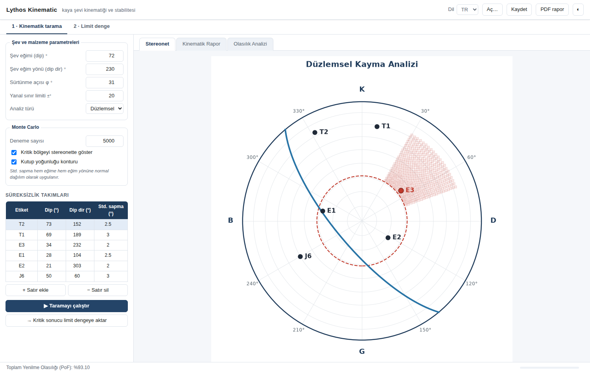
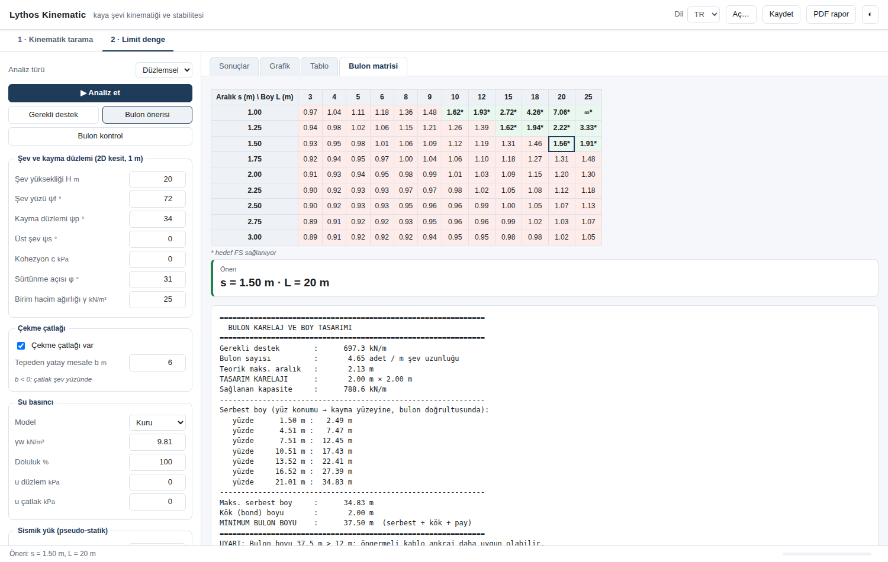
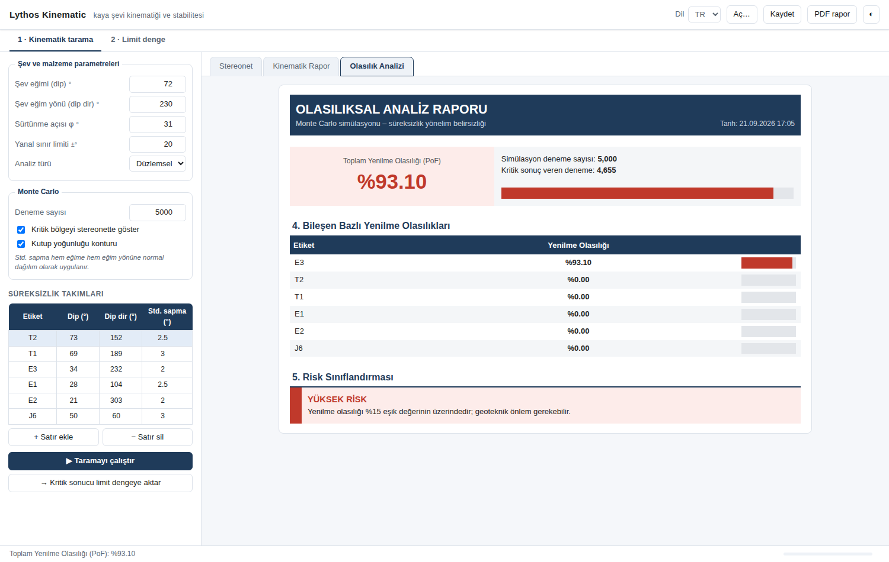
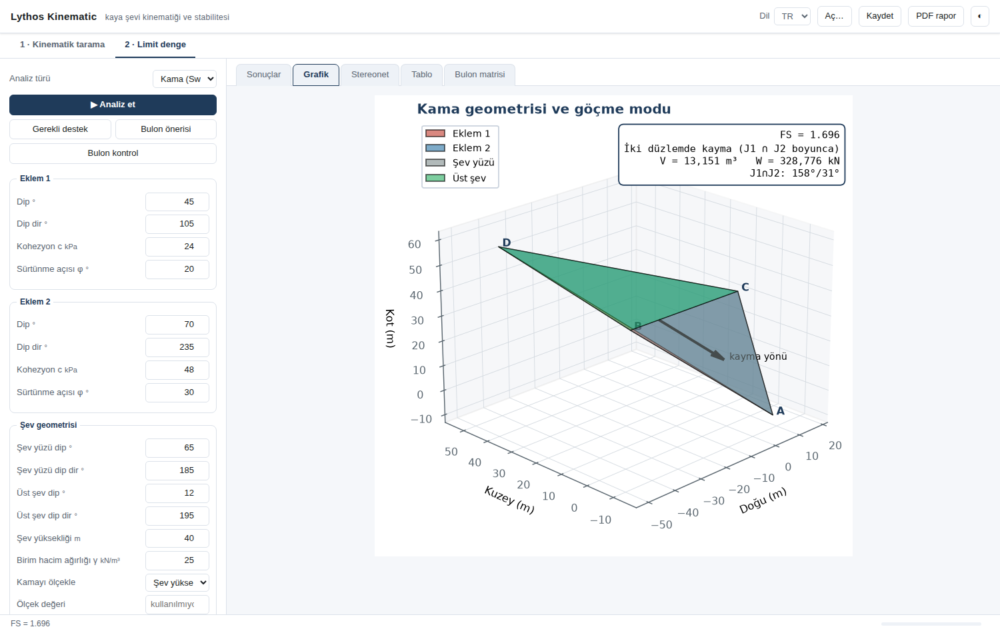
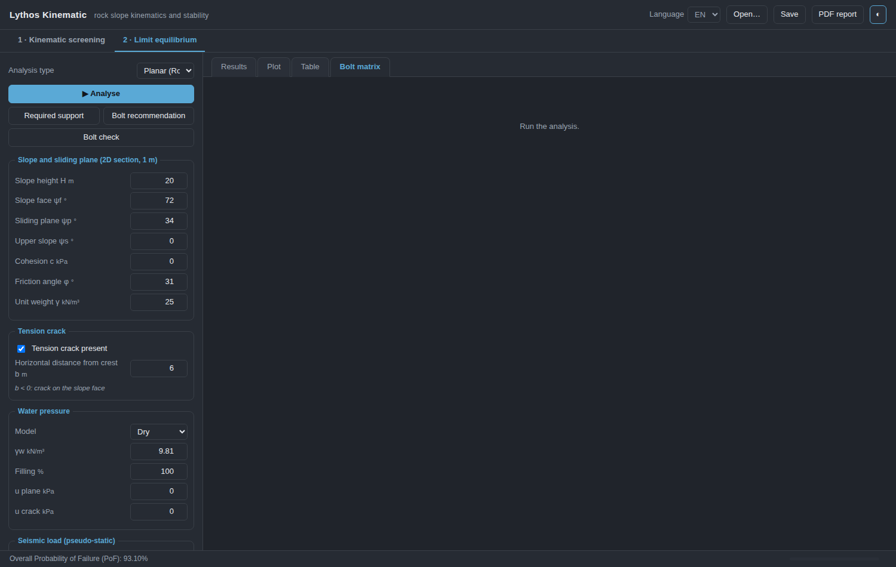

[English](README.md) | **Türkçe**

# Lythos Kinematic

Tarayıcıdan sürülen kaya şevi kinematiği ve stabilitesi. Tek iş akışında iki adım:

1. **Kinematik tarama** — stereonet üzerinde Markland testi, kutup yoğunluğu ve Monte
   Carlo yenilme olasılığı ile *hangi yenilme mekanizmasının mümkün olduğu* belirlenir.
2. **Limit denge** — kritik bulunan mekanizma için *güvenlik sayısı, gerekli destek ve
   bulon tasarımı* hesaplanır.

İki adım arasında canlı bir köprü vardır: taramada bulunan en kritik süreksizlik veya
kesişim, tek tuşla limit denge girdilerine yazılır. Uygulamanın tamamı — her etiket,
sonuç metni, grafik ve PDF raporu — **Türkçe ve İngilizce** olarak çift dillidir; dil
çalışırken değiştirilir.

Arayüz, kendi makinenizde çalışan küçük bir HTTP sunucusudur ve tarayıcıdan sürülür. Bu
seçim programı uzak oturumda ya da kapsayıcı içinde de kullanılabilir kılar (masaüstü
araç takımının isteyeceği bir ekran gerekmez) ve standart kütüphane dışında hiçbir
bağımlılık getirmez.

> Bu program [LythosFEA](https://github.com/hdaltuntas/lythos) ile aynı mimariyi izler.
> Daha önce ayrı iki masaüstü programı olan **SlopeKinematics** ve **Kinematix**
> projelerinin birleşimidir; bkz. [Geçmiş](#geçmiş).

## Ekran görüntüleri

| Kinematik tarama | Bulon aralık × boy matrisi |
|---|---|
|  |  |

| Olasılık analizi | Kama analizi | İngilizce arayüz, koyu tema |
|---|---|---|
|  |  |  |

## Kurulum ve çalıştırma

```bash
pip install lythoskinematic
lythos-kinematic                 # arayüzü tarayıcıda açar
```

Klondan, bilimsel yığın dışında hiçbir şey kurmadan:

```bash
pip install numpy scipy matplotlib reportlab
python main.py
```

Python 3.10+ gerekir.

## Komut satırı

```bash
lythos-kinematic                          # web arayüzü (varsayılan)
lythos-kinematic web --port 9000 --lang EN --no-browser
lythos-kinematic example -o girdi.json    # başlangıç girdi dosyası
lythos-kinematic screen girdi.json -o tarama.pdf
lythos-kinematic run girdi.json --mode wedge -o kama.pdf
```

`screen` ve `run`, arayüzün kaydettiği JSON'u okur; tarayıcıda kurulan bir vaka
gözetimsiz olarak yeniden çalıştırılabilir.

## Ne hesaplar

### Kinematik tarama
- **Kinematik testler:** düzlemsel kayma, kama kayması (Markland), eğilme-devrilme
  (Goodman & Bray)
- **Stereonet:** eşit alan (Schmidt) alt yarımküre projeksiyonu, kutup yoğunluğu konturu
  (Kamb sayım konisi), kritik bölge taraması, sürtünme / kayma limit konisi
- **Monte Carlo:** süreksizlik yönelim belirsizliğini hesaba katarak toplam ve bileşen
  bazlı yenilme olasılığı; arka planda çalışır, sayfa yanıt vermeye devam eder
- **PDF rapor:** kontroller, olasılıklar ve stereonet tek dosyada

### Limit denge
- **Kama (Swedge):** tetrahedral kama geometrisi, Hoek & Bray vektörel limit denge, 3B
  görünüm ve stereonet
- **Düzlemsel (RocPlane):** çekme çatlağı, su basıncı, sismik yük, 2B kesit
- **Devrilme (RocTopple):** Goodman & Bray blok devrilmesi, su + sismik + topuk ankrajı
- **Destek tasarımı:** hedef FS için gerekli kuvvet, tıklanabilir bulon aralık × boy
  matrisi ve seçtiğiniz tasarım için kapasite/FS kontrolü
- **PDF rapor:** proje bilgileri, girdi tabloları, şekiller, kuvvet dengesi tabloları

### Köprü
**"→ Kritik sonucu limit dengeye aktar"** en kritik bileşeni aktarır:

| Tarama modu | Aktarılan girdiler |
|---|---|
| Düzlemsel | kayma düzlemi ψp, şev yüzü ψf, sürtünme açısı φ |
| Kama | Eklem 1 ve Eklem 2 dip/dip dir, şev yüzü dip/dip dir, φ |
| Devrilme | süreksizlik eğimi ψd, şev yüzü ψf, φ |

## Paket düzeni

```
main.py                    klondan, kurmadan çalıştırmak için
lythoskinematic/
  cli.py                   komut satırı (web · screen · run · example)
  i18n.py                  dil anahtarı; çift dilli metin yardımcısı T("tr", "en")
  forms.py                 girdi şeması ve okuyucuları — alan başına tek tanım
  stereonet.py             ortak alt yarımküre projeksiyonu (dış bağımlılıksız)
  render.py                PNG figürler; tarayıcı ve rapor aynısını kullanır
  theme.py                 grafik paleti
  kinematics/              tarama çekirdeği — arayüzden bağımsız
    engine.py              Markland kriterleri + Monte Carlo
    plots.py               tarama stereoneti
    htmlreport.py          HTML rapor gövdeleri
    report.py              tarama PDF raporu
    i18n.py                TR/EN metinler
  rockslope/               limit denge çekirdeği — arayüzden bağımsız
    core.py wedge.py planar.py toppling.py bolts.py report.py style.py text.py
  web/
    server.py              HTTP yönlendirmeleri (yalnızca standart kütüphane)
    session.py             tek çalışma oturumu: analizler, figürler, raporlar
    strings.py             sayfaya gönderilen arayüz metinleri
    static/                index.html · style.css · app.js
tests/                     pytest paketi
```

Formlar `forms.py` şemasından üretilir: bir alanın anahtarı, etiketi, birimi, aralığı ve
varsayılanı Python tarafında bir kez yazılır; sayfa sunucunun gönderdiğini çizer.
JavaScript'te etiketlerin ikinci bir kopyası ve elle eşlenecek bir şey yoktur — dil
değişince şema yeniden alınır.

## Geçmiş

Lythos Kinematic iki masaüstü programı olarak başladı: **SlopeKinematics** (kinematik ve
olasılık, PyQt5) ve **Kinematix** (limit denge, bulon ve rapor, PySide6). Birleştirme üç
değişiklik gerektirdi:

1. **Tek arayüz.** İki Qt bağlaması aynı işlemi paylaşamaz ve masaüstü araç takımı bir
   ekran ister. Her iki arayüz de tarayıcıdan sürülen bu arayüzle değiştirildi; bu aynı
   zamanda iki programın iş akışını tek bir girdi kümesi arkasında birleştirdi.
2. **mplstereonet kaldırıldı.** Stereonet çizimi artık `stereonet.py` içindeki tek ortak
   uygulamadan gelir (eşit alan/eşit açı projeksiyonu, büyük ve küçük daireler, Kamb
   sayım konisiyle kutup yoğunluğu). İki modül birebir aynı geometriyi kullanır ve güncel
   Python sürümlerinde kurulumu bozulan bir bağımlılık ortadan kalkar.
3. **Tek rapor yolu.** Tarama raporu eskiden Qt'nin yazıcısıyla basılıyordu; artık her
   şey limit denge raporuyla aynı reportlab şablonundan geçer. İki modül aynı belgeyi
   üretir ve PDF için ekrana gerek kalmaz.

Projeksiyon birleştirilirken **eşit alan projeksiyonunda bir yarıçap normalizasyon hatası
düzeltildi**: yatay çizgiler (plunge = 0) dış çember yerine yarıçapın %70,7'sine
düşüyordu, yani tüm veri ağın iç kısmına sıkışıyordu. Düzeltme
`tests/test_stereonet.py` ile sabitlendi.

## Doğrulama

```bash
pip install -e ".[dev]"
pytest
```

Çekirdekler kapalı-form çözümlere karşı sabitlenmiştir:

- **kama** — Hoek & Bray kısa çözümüyle birebir (kuru 1.696 / su dolu 1.065)
- **düzlemsel** — c = 0, kuru: tanφ/tanψp
- **devrilme** — Wyllie & Mah 9. bölüm örneği (blok yükseklikleri, göçme modları, limit
  denge φ ≈ 38°)
- **kinematik** — kesişim çizgisi, limit denge çekirdeğinin bağımsız vektör uygulamasına
  karşı çapraz doğrulanır; Monte Carlo, belirsizlik sıfırken deterministik sonucun 0/100
  karşılığını vermelidir
- **stereonet** — projeksiyon yarıçapları analitik Schmidt/Wulff değerlerine, kutuplar
  eğim vektörüne dik olma koşuluna karşı sınanır
- **dil** — her özet dili izler, sabit genişlikli etiket sütunu iki dilde de hizalı kalır,
  sayısal sonuçlar değişmez ve iç anahtarlar hiçbir dilde çevrilmez
- **web** — şema tüm alanları kapsar, oturumun analizleri doğrulanmış sonuçları üretir,
  arka plan işleri durum yoklamasını kilitlemeden biter ve HTTP yönlendirmeleri yığın
  izi yerine PNG figür, PDF rapor ve sade hata iletisi döndürür

## Değişiklik günlüğü

Sürüm geçmişi [CHANGELOG.tr.md](CHANGELOG.tr.md) dosyasındadır.

## Sürüm yayımlama

`tools/upload_to_pypi.py` dağıtımı derler ve yükler; terminalden de, Thonny gibi
bir düzenleyiciden de çalışır: çalıştırıp sorulara yanıt vermek yeterli. `build`
ve `twine` için kendi ortamını kurar, PyPI'da zaten var olan bir sürümü reddeder
ve ne yükleyeceğini göstermeden hiçbir şey göndermez. Prova için dosyanın başındaki
`TEST_PYPI = True` yapılır.

Token depoda tutulmaz: `~/.pypirc` dosyasından okunur ya da sorulur ve doğrudan
twine'a geçirilir. Bir projenin **ilk** yüklemesi hesap kapsamlı ("Entire account")
bir token ister — projeye özel token ancak proje var olduktan sonra üretilebilir.

## Lisans

Telif hakkı © 2026 Hasan Deniz Altuntaş

Lythos Kinematic özgür yazılımdır: Özgür Yazılım Vakfı'nın yayımladığı
[GNU Affero Genel Kamu Lisansı, sürüm 3](LICENSE) koşulları altında yeniden dağıtabilir ve/veya
değiştirebilirsiniz. Yararlı olması umuduyla dağıtılır, ancak HİÇBİR GARANTİSİ YOKTUR;
SATILABİLİRLİK ya da BELİRLİ BİR AMACA UYGUNLUK zımni garantisi dahi yoktur.

Değiştirilmiş bir sürümü kullanıcılara ağ üzerinden sunan, o sürümün kaynak kodunu da onlara
sunmak zorundadır (lisansın 13. bölümü). Bu değişiklikten önce yayımlanan sürümler MIT
lisansıyla dağıtılmıştır ve o lisansla kullanılmaya devam edebilir.
